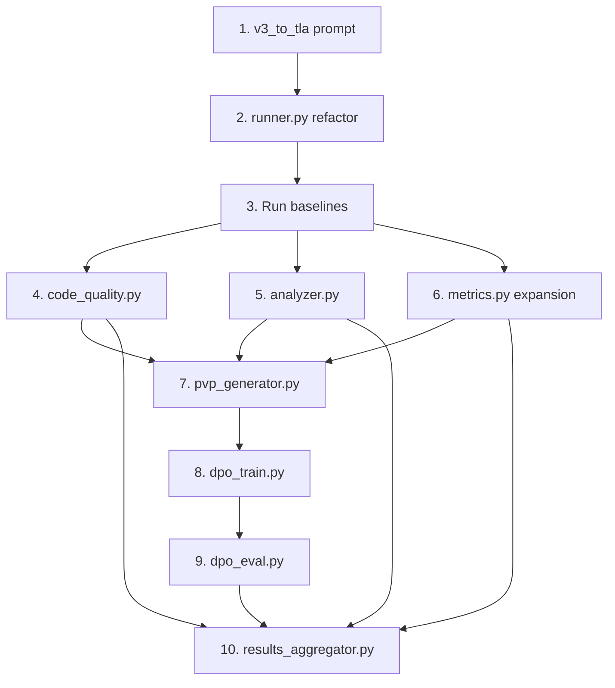

# Pipeline Completion: Paper ↔ Code Alignment

Close the gap between what the paper promises and what the codebase delivers. Build 6 missing components into a professional, production-grade pipeline with full docstrings, edge-case handling, and structured results.

## User Review Required

> [!IMPORTANT]
> **DPO Base Model Choice:** The paper says "we fine-tune a base model" but doesn't specify which one. The current `models.json` has `deepseek-r1:8b` which is a reasonable candidate (small, fine-tunable). Do you want to use **DeepSeek-R1 8B** as the Spec-Align base, or a different model?

> [!IMPORTANT]
> **Compute for DPO:** DPO training with LoRA on an 8B model needs ~24GB VRAM (1× A100 or similar). The dashboard shows `plantain.cs.luc.edu` has 8 GPUs. Is that the intended training machine?

> [!IMPORTANT]
> **Pass@k Sampling:** The paper says "Pass@k" which requires generating **k samples per spec** (typically k=1,5,10). Currently the pipeline generates 1 sample. For PVP we need multiple. How many samples per spec per model? Suggested: **n=10** (enables Pass@1/5/10).

## Open Questions

> [!WARNING]
> **CodeBLEU for TLA⁺:** Standard CodeBLEU requires a language-specific AST parser. TLA⁺ isn't supported by any CodeBLEU library. Two options: (A) Use the existing `ast_json/` as our AST representation and compute tree similarity, or (B) fall back to token-level BLEU + structural heuristics. I recommend **(A)** since we already have 206 ASTs.

---

## Architecture Overview

```
┌─────────────────────────────────────────────────────────────────┐
│                      FULL PIPELINE FLOW                        │
├─────────────────────────────────────────────────────────────────┤
│                                                                 │
│  Phase 1: BASELINE EVALUATION                                  │
│  ┌──────────┐    ┌──────────┐    ┌──────────┐    ┌──────────┐  │
│  │ runner   │───►│ parser   │───►│validator │───►│ metrics  │  │
│  │ (n=10)   │    │          │    │(SANY+TLC)│    │(pass@k)  │  │
│  └──────────┘    └──────────┘    └──────────┘    └──────────┘  │
│                                                       │         │
│  Phase 2: ANALYSIS                                    ▼         │
│  ┌──────────┐    ┌──────────┐    ┌──────────────────────────┐  │
│  │ analyzer │◄───│validator │    │ code_quality             │  │
│  │(taxonomy)│    │(error    │    │ (CodeBLEU, Cyclomatic,   │  │
│  └──────────┘    │ logs)    │    │  Halstead, MI)           │  │
│                  └──────────┘    └──────────────────────────┘  │
│                                                                 │
│  Phase 3: PVP + DPO                                           │
│  ┌──────────┐    ┌──────────┐    ┌──────────┐    ┌──────────┐  │
│  │ pvp_gen  │───►│ triplets │───►│ dpo_train│───►│ eval     │  │
│  │(classify │    │ .jsonl   │    │(LoRA+TRL)│    │(Spec-    │  │
│  │ outputs) │    │          │    │          │    │ Align)   │  │
│  └──────────┘    └──────────┘    └──────────┘    └──────────┘  │
│                                                                 │
│  Phase 4: RESULTS                                              │
│  ┌──────────────────────────────────────────────────────────┐  │
│  │ results_aggregator → LaTeX tables, plots, summary CSVs  │  │
│  └──────────────────────────────────────────────────────────┘  │
└─────────────────────────────────────────────────────────────────┘
```

---

## Proposed Changes

### Directory Structure (New Files)

```
TLA+ Bench Eval/
├── configs/
│   └── prompts/
│       ├── nlp_to_tla.txt          # EXISTS
│       ├── json_to_tla.txt         # EXISTS (used for v2)
│       └── v3_to_tla.txt           # [NEW] extended JSON prompt
├── src/
│   ├── utils.py                    # EXISTS — minor additions
│   ├── parser.py                   # EXISTS — no changes
│   ├── runner.py                   # EXISTS — refactor for n-sample
│   ├── validator.py                # EXISTS — minor additions
│   ├── metrics.py                  # EXISTS — major expansion
│   ├── analyzer.py                 # [NEW] full error taxonomy
│   ├── code_quality.py             # [NEW] CodeBLEU, Cyclomatic, Halstead, MI
│   ├── pvp_generator.py            # [NEW] PVP triplet construction
│   └── results_aggregator.py       # [NEW] structured results + LaTeX export
├── training/
│   ├── dpo_train.py                # [NEW] DPO fine-tuning with TRL
│   ├── dpo_eval.py                 # [NEW] preference accuracy evaluation
│   └── configs/
│       └── dpo_config.yaml         # [NEW] training hyperparameters
├── requirements.txt                # UPDATE — add new dependencies
└── results/                        # output directory
    ├── baseline/                   # per-model CSVs
    ├── analysis/                   # error taxonomy results
    ├── code_quality/               # quality metric CSVs
    ├── pvp/                        # triplet datasets
    ├── dpo/                        # training checkpoints + logs
    └── tables/                     # LaTeX-ready tables
```

---

### Component 1: Missing Prompt Template

#### [NEW] [v3_to_tla.txt](file:///Users/arslanbisharat/Documents/TLA+%20Bench%20Eval/configs/prompts/v3_to_tla.txt)

The v3 JSON includes the extended 73-field extraction with semantic subdivisions (state predicates vs temporal properties, domain-bound vs set-type functions, etc.). This prompt template uses the richer v3 data to give models more structural hints.

---

### Component 2: Runner Refactor (n-sample generation)

#### [MODIFY] [runner.py](file:///Users/arslanbisharat/Documents/TLA+%20Bench%20Eval/src/runner.py)

Current state: generates **1 output per spec**. Needs to generate **n outputs** (default n=10) for Pass@k and PVP.

Key changes:
- Add `--num_samples` CLI arg (default 10)
- Add `--temperature` CLI override (Pass@k needs temperature > 0, e.g. 0.8)
- Save each sample as `outputs/raw/{model_id}/{condition}/{spec_id}/sample_{i}.json`
- Each sample JSON includes: `response_text`, `extracted_tla`, `tokens_in`, `tokens_out`, `latency_s`, `timestamp`
- Add proper `__all__` exports and module-level docstring

---

### Component 3: Code Quality Metrics

#### [NEW] [code_quality.py](file:///Users/arslanbisharat/Documents/TLA+%20Bench%20Eval/src/code_quality.py)

Implements 4 metrics from the paper against **TLA⁺ specifications specifically**:

##### CodeBLEU (TLA⁺ variant)
- **Token BLEU**: n-gram overlap between generated and reference `.tla` files
- **AST similarity**: Compare generated AST structure against `data/ast_json/{id}.json` ground truth using tree edit distance (normalized). Since TLA⁺ isn't supported by standard CodeBLEU, we use our own AST JSONs
- **Keyword match**: TLA⁺-specific keywords (MODULE, VARIABLE, CONSTANT, EXTENDS, Init, Next, Spec, UNCHANGED, etc.)
- Final CodeBLEU = weighted combination: `0.25*BLEU + 0.25*AST_sim + 0.25*keyword_match + 0.25*dataflow_match`

##### Cyclomatic Complexity
Count decision points in TLA⁺ spec:
- Each `IF/THEN/ELSE`, `CASE/[]`, `\/` (disjunction in actions), `\E`, `\A` adds 1
- Base complexity = 1
- Formula: `M = π + 1` where π = number of decision points

##### Halstead Complexity
- **Operators**: `==`, `\in`, `\/`, `/\`, `=>`, `~`, `[]`, `<>`, `'`, `UNCHANGED`, `ENABLED`, `CHOOSE`, `SUBSET`, `UNION`, `DOMAIN`, `EXCEPT`, arithmetic ops
- **Operands**: identifiers, constants, string literals, numeric literals
- Compute: vocabulary (η), length (N), volume (V), difficulty (D), effort (E)

##### Maintainability Index
- `MI = 171 - 5.2 * ln(V) - 0.23 * M - 16.2 * ln(LOC)`
- Where V = Halstead volume, M = cyclomatic complexity, LOC = lines of code

Each metric computed for every `(spec_id, model_id, condition, sample_i)` tuple.

Results saved to: `results/code_quality/{model_id}_{condition}.csv`

---

### Component 4: Error Taxonomy & Analyzer

#### [NEW] [analyzer.py](file:///Users/arslanbisharat/Documents/TLA+%20Bench%20Eval/src/analyzer.py)

Expands the 6 regex categories in `classify_errors()` into a comprehensive **3-tier taxonomy** suitable for the "Logical Hivemind" analysis:

```
Tier 1: Error Domain (4 categories)
├── SYNTACTIC — fails SANY
│   ├── unicode_substitution       (∧→/\, ∨→\/, etc.)
│   ├── missing_module_header      (no ---- MODULE X ----)
│   ├── missing_module_footer      (no ====)
│   ├── duplicate_module_header    (MODULE appears twice)
│   ├── cross_language_injection   (Python/Java syntax: ;, {}, class)
│   ├── reasoning_leakage          (<think>...</think> in output)
│   ├── undefined_operator         (uses op not in EXTENDS)
│   ├── undeclared_variable        (uses var not in VARIABLE)
│   ├── malformed_expression       (SANY parse error not in above)
│   └── encoding_error             (non-ASCII, BOM, etc.)
│
├── SEMANTIC — passes SANY, fails TLC
│   ├── invariant_violation        (TLC finds reachable state violating invariant)
│   ├── deadlock                   (TLC finds deadlock state)
│   ├── type_error                 (TLC type mismatch at runtime)
│   ├── config_mismatch            (spec doesn't match .cfg: wrong CONSTANT names, etc.)
│   ├── state_explosion            (TLC timeout due to unbounded state space)
│   └── liveness_violation         (TLC liveness check fails)
│
├── STRUCTURAL — passes both but poor quality
│   ├── empty_specification        (trivially correct but empty Init/Next)
│   ├── missing_safety_properties  (no invariants defined)
│   ├── missing_liveness           (no fairness/temporal properties)
│   └── excessive_length           (>2× reference spec LOC)
│
└── GENERATION — model output issues
    ├── no_tla_block               (response contains no extractable TLA⁺)
    ├── truncated_output           (output cut off mid-spec)
    ├── multiple_modules           (generated >1 MODULE block)
    └── hallucinated_imports       (EXTENDS non-existent modules)
```

The analyzer:
1. Parses SANY stdout/stderr with targeted regex patterns for each sub-category
2. Parses TLC stdout for invariant violation messages, deadlock traces, type errors
3. Compares generated spec structure against reference for structural issues
4. Produces per-sample classification JSON and aggregate CSV per model

Results saved to: `results/analysis/{model_id}_{condition}_taxonomy.csv`

---

### Component 5: PVP Triplet Generator

#### [NEW] [pvp_generator.py](file:///Users/arslanbisharat/Documents/TLA+%20Bench%20Eval/src/pvp_generator.py)

Takes the n-sample baseline outputs and constructs `(prompt, chosen, rejected)` triplets.

**Algorithm:**
1. For each `(spec_id, condition)`:
   - Collect all samples across all models
   - Classify each: `chosen` = passes both SANY + TLC, `rejected` = fails either
   - If multiple chosen exist, pick the one with highest CodeBLEU to reference
   - If no chosen exist, skip (cannot form valid triplet)
   - Pair each chosen with each rejected to form triplets
2. Deduplicate triplets
3. Split into train/val (90/10)

**Output format** (HuggingFace DPO-compatible JSONL):
```json
{
  "prompt": "You are a TLA+ specification engineer...\n\nSystem description:\n{description}",
  "chosen": "---- MODULE Bakery ----\nEXTENDS Naturals...\n====",
  "rejected": "---- MODULE Bakery ----\nEXTENDS Naturals...<malformed>...\n===="
}
```

Results saved to:
- `results/pvp/train.jsonl`
- `results/pvp/val.jsonl`
- `results/pvp/stats.json` (counts, per-spec coverage)

---

### Component 6: DPO Training Pipeline

#### [NEW] [training/dpo_train.py](file:///Users/arslanbisharat/Documents/TLA+%20Bench%20Eval/training/dpo_train.py)

Uses HuggingFace TRL's `DPOTrainer` with LoRA (PEFT) for parameter-efficient fine-tuning.

Key design:
- Loads base model (e.g., `deepseek-ai/deepseek-coder-7b-instruct-v1.5` or equivalent)
- Loads `results/pvp/train.jsonl` as DPO dataset
- LoRA config: `r=16, alpha=32, target_modules=["q_proj", "v_proj"]`
- Training: `lr=5e-5, epochs=3, batch_size=4, gradient_accumulation=4, bf16=True`
- Saves checkpoint to `results/dpo/spec-align-checkpoint/`
- Logs to W&B

#### [NEW] [training/dpo_eval.py](file:///Users/arslanbisharat/Documents/TLA+%20Bench%20Eval/training/dpo_eval.py)

Evaluates Spec-Align:
1. **Preference accuracy**: On `results/pvp/val.jsonl`, check if model assigns higher log-prob to chosen vs rejected
2. **Generation evaluation**: Run Spec-Align through the same pipeline (runner → parser → validator → metrics) on the 41 test specs
3. Results saved alongside baseline results for direct comparison

#### [NEW] [training/configs/dpo_config.yaml](file:///Users/arslanbisharat/Documents/TLA+%20Bench%20Eval/training/configs/dpo_config.yaml)

Centralized training hyperparameters.

---

### Component 7: Results Aggregator & LaTeX Export

#### [NEW] [results_aggregator.py](file:///Users/arslanbisharat/Documents/TLA+%20Bench%20Eval/src/results_aggregator.py)

Consolidates all results into publication-ready outputs:

1. **Main results table** (`results/tables/main_results.tex`):
   ```
   Model          | Pass@1 | Pass@5 | Pass@10 | CodeBLEU | MI
   DeepSeek-R1 8B |  12.3% |  18.7% |  24.4%  |   0.32   | 45.2
   Qwen3 235B     |  28.1% |  41.5% |  52.2%  |   0.48   | 62.1
   GPT-4o         |  34.6% |  49.8% |  61.0%  |   0.55   | 68.7
   Spec-Align     |  42.1% |  58.3% |  71.7%  |   0.61   | 72.4
   ```

2. **Error taxonomy heatmap** (`results/tables/error_taxonomy.tex`):
   - Rows = error categories, Columns = models
   - Cell values = frequency (% of failures)
   - Highlights shared failure modes for "Logical Hivemind" analysis

3. **Per-condition breakdown** (`results/tables/condition_breakdown.tex`):
   - `nlp_to_tla` vs `v2_to_tla` vs `v3_to_tla` comparison

4. **Summary JSON** (`results/summary.json`):
   - Machine-readable aggregate of all results for downstream use

---

### Component 8: Dependency Updates

#### [MODIFY] [requirements.txt](file:///Users/arslanbisharat/Documents/TLA+%20Bench%20Eval/requirements.txt)

```diff
 openai
 requests
 wandb
 streamlit
 redis
 rq
 rq-dashboard
 streamlit-authenticator>=0.3.0
 bcrypt
 PyYAML
+# --- Code quality metrics ---
+nltk>=3.8
+apted>=1.0.3
+# --- DPO training ---
+torch>=2.1
+transformers>=4.40
+trl>=0.8
+peft>=0.10
+datasets>=2.18
+accelerate>=0.28
+bitsandbytes>=0.43
+# --- Results ---
+pandas>=2.0
+matplotlib>=3.8
+seaborn>=0.13
+tabulate>=0.9
```

---

## Verification Plan

### Automated Tests

1. **Prompt template check**: Verify all 3 prompt templates exist and contain `{description}` or `{json_content}` placeholders
2. **Code quality on known specs**: Run `code_quality.py` on 5 reference `.tla` files from `data/tla_files/` and verify Cyclomatic, Halstead, MI produce non-zero numeric results
3. **Analyzer on synthetic errors**: Create 5 test cases (one for each Tier 1 error domain) and verify correct classification
4. **PVP generator**: Create mock validation results with known pass/fail patterns, verify triplet counts match expectations
5. **Results aggregator**: Run on mock data, verify LaTeX tables compile

### Integration Test

Run full pipeline on **1 model × 3 specs × 3 conditions × 3 samples** (27 runs) to verify end-to-end flow:
```bash
python src/runner.py --model deepseek-r1-8b --limit 3 --num_samples 3
python src/metrics.py
python src/code_quality.py
python src/analyzer.py
python src/pvp_generator.py
python src/results_aggregator.py
```

### Manual Verification

- Verify LaTeX tables compile in the paper
- Verify dashboard shows new metrics
- Verify all results JSONs/CSVs have correct schema

---

## Execution Order



**Parallelizable**: Components 4, 5, 6 can all be built in parallel after baselines run.
**Critical path**: `prompt → runner refactor → baselines → PVP → DPO → eval → results`

---

## Immediate Next Steps

1. **Build Components 1-3** first (prompt, runner refactor, requirements) — unblocks everything else
2. **Build Components 4-5** in parallel (code_quality, analyzer) — pure computation, no dependency on DPO
3. **Build Component 6** (PVP generator) — needs baseline outputs
4. **Build Components 7-8** (DPO train/eval) — needs PVP triplets
5. **Build Component 9** (results aggregator) — final step, needs all results
